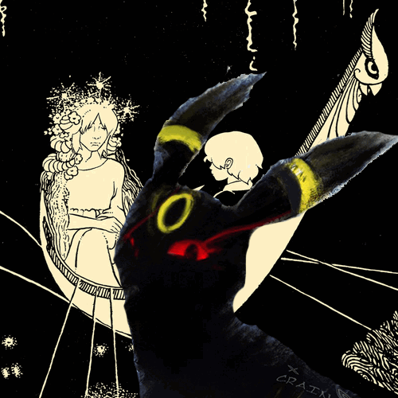

# Coverloop
Pick your favourite albums and stitch the cover art together into an animated GIF.
Layer over a PNG to make it truly yours.

Try it out for yourself: https://coverloop.vercel.app

Hosted on Vercel + Render's free tiers.

# APIs
As a primary search, Deezer is used due to high-quality album covers and consistent information.
However, it's linked to streaming services; if they're not on Spotify / Apple Music, you might not find them
(ex: Godspeed You! Black Emperor).

To handle these cases, Coverloop uses MusicBrainz's API to get the albums that might've been pulled from streaming.
As a final fallback, Discogs is used (this may be getting dropped due to being obsolete in this implementation).
